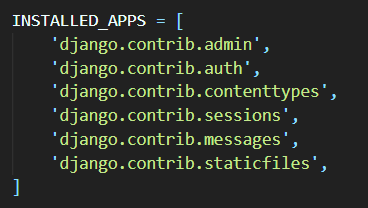

# User authentication in Django

장고는 유저 인증 시스템을 제공한다. 이 시스템은 사용자 계정과 그룹, 권한, 쿠기 기반의 유저 세션을 다룬다.

## 🍞개요

장고 인증 시스템에서는 autentication과 authorization을 모두 다룬다. autentication은 사용자가 올바른지 확인하는 것이고, authorization은 인증된 사용자가 할 수 있는 것을 결정하는 것이다.

#### 제공하는 인증 시스템

- 사용자
- 권한
- 그룹
- 비밀번호 해싱 시스템
- 로그인 또는 내용 제한을 위한 양식/툴
- 플러그형 백엔드 시스템

But, `장고는 비밀번호의 강도 검사`, `로그인 시도 제한`, `타사 인증`, `객체 수준의 권한 설정`을 제공하지 않는다. 따라서 이러한 기능을 사용하기 위해서는 별도의 패키지를 설치해야 한다.

## 🍞설치

장고의 conf 모듈인 `django.conf.auth`을 통해 사용할 수 있다. 프로젝트를 `django-admin startproject <name>`으로 생성하면 자동적으로 `settings.py`에 포함된다.

## 🍞사용법

- [Using Django's default implementation](auth_using.md)
  - Working with User objects
  - Permissions and authorization
  - Authentication in web request
  - Managing users in the admin
- API reference for the default implementation
- Customizing Users and authentication
- Password management in Django

## 📌Reference

https://docs.djangoproject.com/en/3.1/topics/auth/
