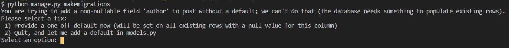

# Django Error - You are trying to add a non-nullable field ...

## 🔒Problem

django 프로젝트에서 model을 수정하고

```bash
$ python manage.py makemigrations
```

를 진행하는 과정에서 다음과 같은 에러가 발생했다.

```
You are trying to add a non-nullable field 'author' to post without default; we can't do that(the database needs something to populate existing rows). Please select a fix:
 1) Provide a one-off default now (will be set on all existing rows with a null value for this column)
 2) Quit, and let me add a default in models.py
 Select an option:
```



DB 모델을 수정할 경우 종종 발생하는 오류라고 한다. 기존의 모델을 기반으로 생성된 객체들에 대해 추가/수정된 필드를 어떻게 처리할 것인지 묻는 것이다.

## 🔑Solution

이를 해결하기 위해서는 2번 옵션을 선택하고 코드상에서 `default=""` 혹은 `null=True` 옵션을 입력하면 된다. 이후 `makemigrations`를 하면 정상적으로 동작할 것이다.

models.py

```python
class Post(models.Model):
    author = models.ForeignKey(
    settings.AUTH_USER_MODEL,
    on_delete=models.CASCADE,
    default="", #추가한 라인
)
```

## Reference

https://stackoverflow.com/questions/26185687/you-are-trying-to-add-a-non-nullable-field-new-field-to-userprofile-without-a <br>
https://has3ong.tistory.com/238 <br>
