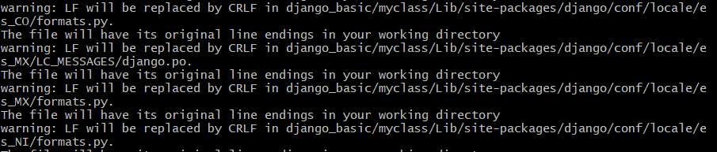
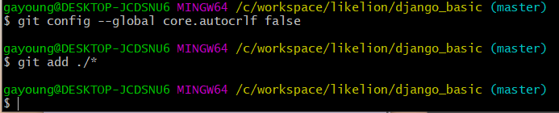

# Git Error - LF will be replaced by CRLF ...

## 🔒Problem

git add를 진행하는 과정에서 다음과 같은 에러가 발생했다.

```
warning: LF will be replaced by CRLF in project/django/conf...
The file will have its original line endings in your working directory
```



맥/ 리눅스 환경과 윈도우의 환경이 달라 발생하는 `Whitespace` 에러라고 한다.<br>
유닉스 시스템에서는 한 라인의 끝이 LF(Line Feed)로 이루어지는 반면, 윈도우에서는 한 라인이 CR(Carriage Return)과 LF(Line Feed), 즉 CRLF로 이루어지기 때문이다. Git이 어떤 시스템을 따라야 할 지 몰라서 내는 에러라고 보면 된다.

## 🔑Solution

이를 해결하기 위해서는 다음 명령어를 입력하면 된다.
시스템 전체가 아닌 해당 프로젝트에만 적용하고 싶다면 `--global`을 빼면 된다.

```
git config --global core.autocrlf true
```

이는 git의 자동 변환 기능을 키는 것이다.

> commit할 때 자동으로 CRLF를 LF로 변환해주고 반대로 checkout 할 때 LF를 CRLF로 변환해 주는 기능

<br>

변환 기능을 원치 않을 때는 다음 명령어를 입력하면 된다.
윈도우 플랫폼에서만 개발하는 경우 이 기능이 필요가 없으므로 `false`라고 설정하면 이 기능이 꺼지고 CR 문자도 저장소에 저장된다.

```
git config --global core.autocrlf false
```


git add가 정상적으로 동작한다.

## Reference

https://git-scm.com/book/ko/v2/Git%EB%A7%9E%EC%B6%A4-Git-%EC%84%A4%EC%A0%95%ED%95%98%EA%B8%B0<br>
https://blog.jaeyoon.io/2018/01/git-crlf.html<br>
https://stackoverflow.com/questions/5834014/lf-will-be-replaced-by-crlf-in-git-what-is-that-and-is-it-important
