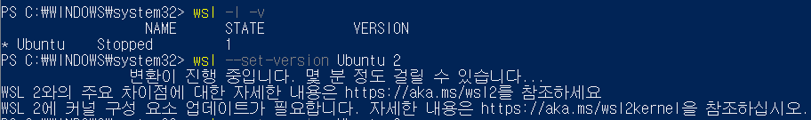
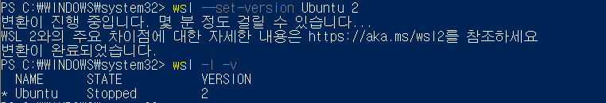

# WSL - WSL 2에 커널 구성 요소 업데이트가 필요합니다.

## 🔒Problem

[WSL 설치 튜토리얼](https://docs.microsoft.com/ko-kr/windows/wsl/install-win10#troubleshooting-installation)을 보면서 설치하다가 WSL1에서 2로 업데이트 하는 과정에서 다음과 같은 애러가 발생했다.

## 🔑Solution

[wsl_update_x64](https://wslstorestorage.blob.core.windows.net/wslblob/wsl_update_x64.msi)를 설치하고 다시 명령을 입력했더니 에러가 사라졌다! 버전도 2로 바뀐 것을 볼 수 있다.

