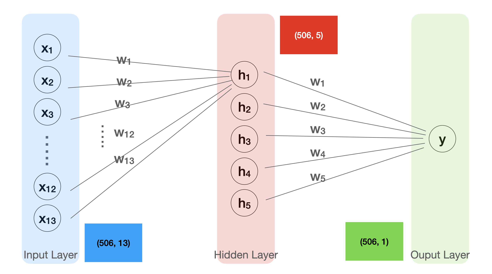

# 05. Deep Learning 4 - Hidden Layer

## 🍞Hidden Layer?

Hidden Layer는 입력 층과 결과 층 사이에 퍼셉트론을 추가하는 것이다. 출력 값 하나(y)를 만들기 위해서는 하나의 퍼셉트론이 필요하고, 히든레이어 값 하나(h1)을 만들기 위해서도 하나의 퍼셉트론이 필요하다. 따라서 아래 그림은 5개의 히든레이어를 추가했으니 5개의 퍼셉트론이 필요하다. <br>

히든레이어와 출력 층만 보면 5개의 입력으로 1개의 출력을 만드는 모델이라고 할 수 있고, 입력 층과 히든레이어만 보면 13개의 입력으로 5개의 출력을 만드는 모델이라고 할 수 있다. 이렇게 각각의 모델을 연속적으로 연결하여 거대한 신경망을 만드는 것이 딥러닝 인공신경망이다.



## 🍞Code

모델의 구조를 만드는 과정에서 적용할 수 있으며, 히든레이어의 활성화 함수는 'swish'를 사용한다. 히든레이어를 여러 층으로 쌓을 수록 성능이 좋은 모델이 완성된다.

```python
X = tf.keras.layers.Input(shape=[13])
H = tf.keras.layers.Dense(10, activation='swish')(X)
Y = tf.keras.layers.Dense(1)(H)
model = tf.keras.models.Model(X, Y)
model.compile(loss='mse')
```

## 🍞실습

Hidden layer 없이 그냥 학습시킨 모델의 코드와 비교하면서 loss값을 살펴보면 아래 코드들의 loss가 더 작은 것을 알 수 있다.

[📝 boston with hidden layer 실습 코드](./code/boston_h.ipynb)
[📝 iris with hidden layer 실습 코드](./code/iris_h.ipynb)
