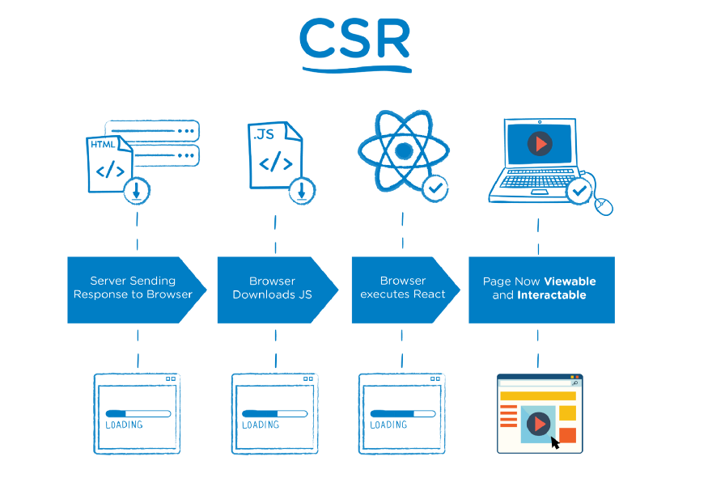
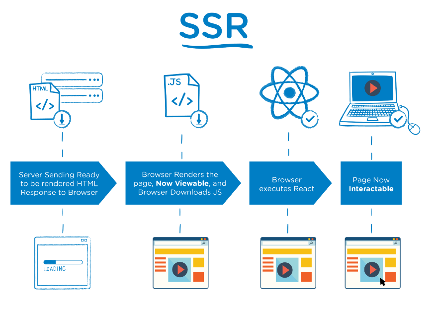

# CSR vs SSR

CSR과 SSR은 유저가 Brower에서 보는 화면의 구성을 `어디서 만들어 주는지`에 따라 구분한다. CSR은 클라이언트에서 SSR은 서버에서 화면을 구성한다.

## 🍞 CSR

CSR(client-side rendering)은 서버에서 우선 데이터가 없는 빈 문서(단순한 HTML 구조와 JavaScript 링크, static 파일)만 받아오고, **JavaScript를 통해 brower에 보이는 페이지를 동적으로 렌더링**하는 방식이다. 필요에 따라 문서가 로드된 이후에 필요한 데이터를 추가로 요청해서 페이지를 재구성한다.

[출처: [The Benefits of Server Side Rendering Over Client Side Rendering](https://medium.com/walmartglobaltech/the-benefits-of-server-side-rendering-over-client-side-rendering-5d07ff2cefe8)]

#### 장점

- 초기 로드만 완료되면 이후 렌더링이 빠르다.
- 서버에 요청할 일이 거의 없어서 서버 부담이 적다.
- Web Applications에 좋다.

#### 단점

- SEO에 좋지 않다. (처음에 HTML은 비어있기(데이터가 없기) 때문에 데이터 수집이 어려워서)
- 초기 로드가 오래 걸린다.
- 외부 라이브러리가 필요한 경우가 많다.

## 🍞 SSR

SSR(server-side rendering)은 **서버에서 사용자에게 보여줄 페이지(완전한 HTML)를 모두 구성**하여 사용자에게 페이지를 보여주는 방식이다.

[출처: [The Benefits of Server Side Rendering Over Client Side Rendering](https://medium.com/walmartglobaltech/the-benefits-of-server-side-rendering-over-client-side-rendering-5d07ff2cefe8)]

#### 장점

- SEO가 좋다. (HTML에 모든 정보가 포함되어 있기 때문에 데이터 수집 가능)
- 초기 로딩 속도가 빠르다.
- Static sites에 좋다.

#### 단점

- 서버에 매번 요청하기 때문에 서버 부하가 크다.
- 매번 페이지가 새로고침 된다. (UX 다소 떨어짐)
- 렌더링이 느리다.

## 📌Reference

https://medium.com/walmartglobaltech/the-benefits-of-server-side-rendering-over-client-side-rendering-5d07ff2cefe8  
https://velog.io/@namezin/CSR-SSR
